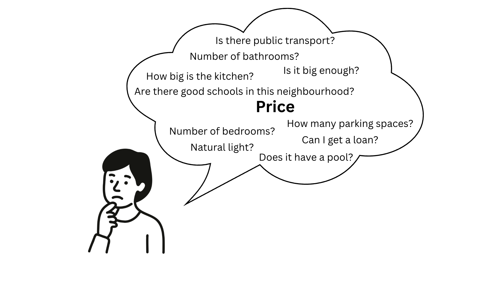
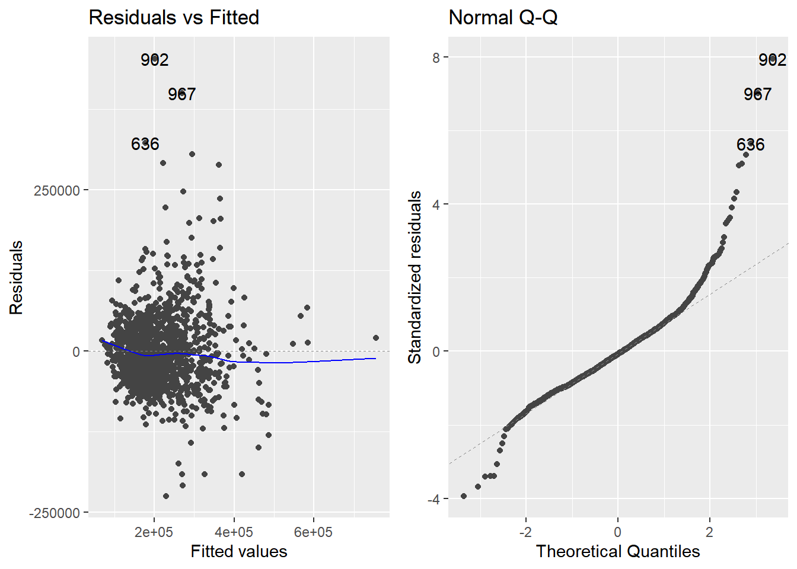
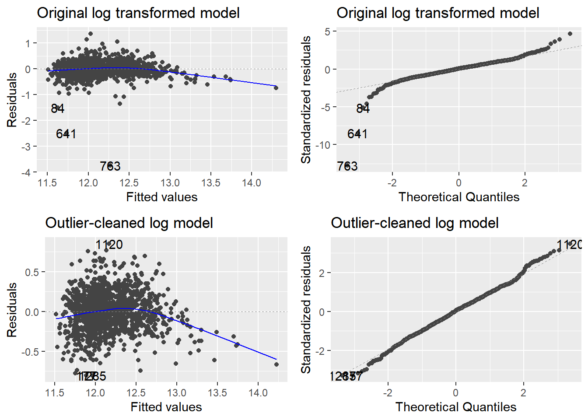
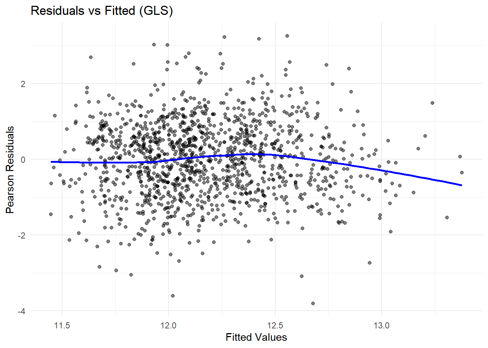
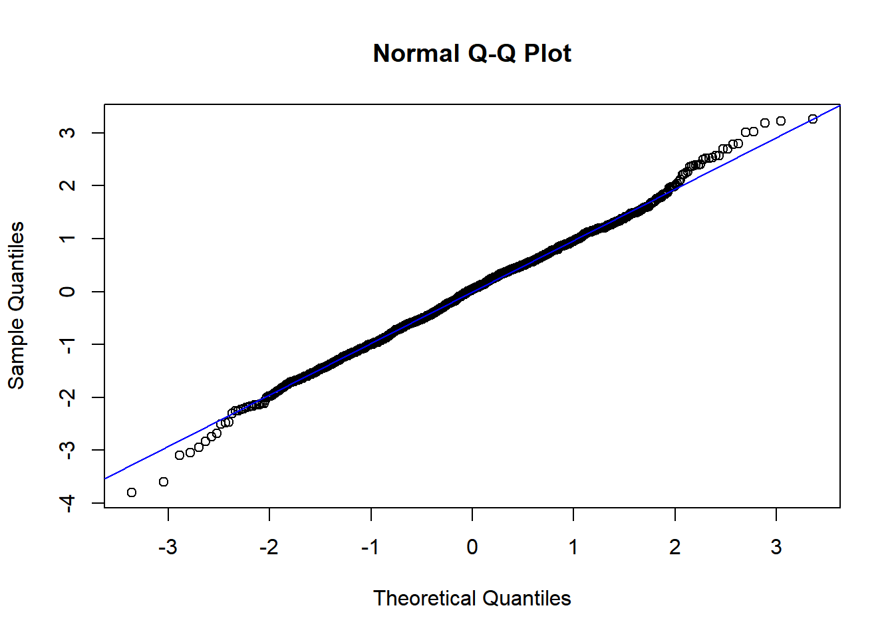
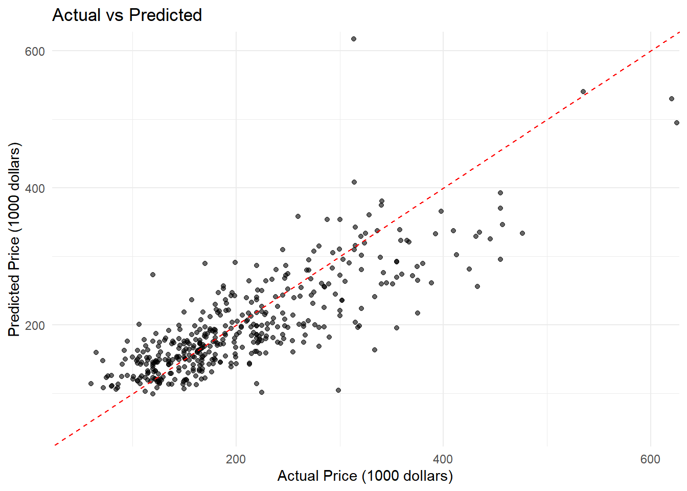

## Problem

{width="722"}

## Can we predict housing prices based on features?


## Explain the Data

-   **Source:** Random sample of **1734 houses** from the Saratoga Housing Data (De Veaux, 2006), originally from the *Journal of Statistics Education*.
-   **Dataset:** 17 variables used to predict the target variable, **Price**.
-   **Data Split:** Includes a `Test` column to separate data into training (Test=0) and testing (Test=1) sets.

::::: {.columns style="font-size:0.6em;"}
::: {.column width="45%"}
**Numerical Variables**

-   [Price]{style="color:#CC79A7;"} (Target)
-   [Lot.Size]{style="color:#CC79A7;"}
-   [Age]{style="color:#CC79A7;"}
-   [Land.Value]{style="color:#CC79A7;"}
-   [Living.Area]{style="color:#CC79A7;"}
-   [Pct.College]{style="color:#CC79A7;"}
:::

::: {.column width="55%"}
**Categorical Variables**

-   [Waterfront]{style="color:#0072B2;"} (Binary)
-   [New.Construct]{style="color:#0072B2;"} (Binary)
-   [Central.Air]{style="color:#0072B2;"} (Binary)
-   [Fuel.Type]{style="color:#0072B2;"} (Nominal)
-   [Heat.Type]{style="color:#0072B2;"} (Nominal)
-   [Sewer.Type]{style="color:#0072B2;"} (Nominal)
-   [Bedrooms]{style="color:#0072B2;"} (Discrete)
-   [Fireplaces]{style="color:#0072B2;"} (Discrete)
-   [Bathrooms]{style="color:#0072B2;"} (Discrete)
-   [Rooms]{style="color:#0072B2;"} (Discrete)
:::
:::::

## IDA - Relationships Between the Variables

::::: columns
::: {.column width="65%"}
```{r}
library(dplyr)
library(tidyr)
library(ggplot2)
library(tibble)

# 1. Read the data (assuming "housing-prices-ge19.txt" is tab-delimited)
house_prices <- read.delim("housing-prices-ge19.txt") 
house_prices <- subset(house_prices, Test == 0)

# 2. Fix column names
names(house_prices) <- make.names(names(house_prices), unique = TRUE)

# 3. Select only numeric columns
# We explicitly select the main numeric columns and convert to numeric 
# just in case read.delim failed to infer types correctly.
num_vars <- house_prices %>% 
  dplyr::select(
    Price, Lot.Size, Waterfront, Age, Land.Value, New.Construct, Central.Air,
    Living.Area, Pct.College, Bedrooms, Fireplaces, Bathrooms, Rooms
  ) %>%
  # Ensure all selected columns are numeric (coercing errors to NA if needed)
  mutate(across(everything(), as.numeric)) 

# 4. Compute correlation matrix (handle missing values)
cor_matrix <- cor(num_vars, use = "pairwise.complete.obs")

# 5. "Melt" the matrix into long format (required for ggplot geom_tile)
melted_cor_mat <- cor_matrix %>%
  # Convert matrix to data frame, keeping row names
  as.data.frame() %>%
  # Convert row names to a column (var1)
  rownames_to_column(var = "var1") %>%
  # Pivot all columns (except var1) into two columns: var2 (name) and cor (value)
  pivot_longer(
    cols = -var1, 
    names_to = "var2", 
    values_to = "cor"
  )

# 6. Create the Heatmap Plot
ggplot(melted_cor_mat, aes(x = var1, y = var2, fill = cor)) +
  geom_tile() +
  # Add correlation values as text annotations
  geom_text(aes(label = round(cor, 2)), color = "black", size = 3) + 
  theme_minimal(base_size = 12) + # Adjust base_size for better display
  # Use a blue-white-red gradient for correlation visualization
  scale_fill_gradient2(
    low = "blue", 
    high = "red", 
    mid = "white", 
    midpoint = 0, 
    limit = c(-1, 1),
    name = "Corr."
  ) +
  labs(
    title = "Correlation Matrix Heatmap of Numeric Variables",
    x = "",
    y = ""
  ) +
  theme(
    # Rotate X-axis labels for readability
    axis.text.x = element_text(angle = 90, hjust = 1, vjust = 0.5),
    # Ensure titles are readable
    plot.title = element_text(hjust = 0.5),
    # Remove plot ticks and grid lines
    panel.grid.major = element_blank(),
    panel.grid.minor = element_blank()
  )
```
:::

::: {.column width="35%"}
```{r, warning=FALSE, message=FALSE}
library(dplyr)
library(tibble)
library(knitr) # <--- ADDED for kable output

set.seed(123)

# Assuming "housing-prices-ge19.txt" is in your working directory
house_prices <- read.delim("housing-prices-ge19.txt")

# Fix column names to remove spaces/dots for easier access
names(house_prices) <- make.names(names(house_prices), unique = TRUE)

# Keep only training data
data <- subset(house_prices, Test == 0)

# Select only numeric columns
num_vars <- data %>% 
  dplyr::select(where(is.numeric))

# Compute correlation matrix (handle missing values)
cor_matrix <- cor(num_vars, use = "pairwise.complete.obs")

# Round correlations
cor_matrix <- round(cor_matrix, 2)

# Get top 5 correlations with Price (excluding Price itself)
top5_corr_vector <- cor_matrix["Price", ] %>%
  sort(decreasing = TRUE) %>%
  .[names(.) != "Price"] %>%
  .[1:5]

# Convert the named vector into a two-column tibble
top5_corr_table <- top5_corr_vector %>%
  enframe(name = "Predictor Variable", value = "Correlation with Price")

# Display the table using kable
knitr::kable(
  top5_corr_table,
  caption = "Top 5 Predictor Correlations with Price",
  # Round correlation values to 2 decimal places in the output
  digits = 2, 
  align = "lr"
)
```
:::
:::::

## IDA - Ordinal & Categorical Transformations

-   the data was split into training (`Test == 0`) and testing (`Test == 1`) sets, and transforming variables into the correct format.
-   FuelType and HeatType variables contained "None" entries. We treated these as missing values (NA) and removed the affected rows from both the training and test sets.
-   We converted all categorical predictors to factors.R automatically performs one-hot encoding, giving a total of 21 predictors

```{r, echo=FALSE, message=FALSE, warning=FALSE}
# Load necessary libraries
library(readr)
library(dplyr)
library(stringr)

# Load data and standardize column names (e.g., Lot.Size -> LotSize)
house_prices <- read_tsv("housing-prices-ge19.txt")
names(house_prices) <- str_replace_all(names(house_prices), "\\.", "")

# Split into training and testing sets
train_data <- house_prices %>% filter(Test == 0)
test_data <- house_prices %>% filter(Test == 1)

# Convert "None" to NA and drop rows
train_data_cleaned <- train_data %>%
  mutate(
    FuelType = na_if(as.character(FuelType), "None"),  
    HeatType = na_if(as.character(HeatType), "None")  
  ) %>%
  na.omit() # drop all rows with any NAs

test_data_cleaned <- test_data %>%
  mutate(
    FuelType = na_if(as.character(FuelType), "None"),
    HeatType = na_if(as.character(HeatType), "None")
  ) %>%
  na.omit()

# Show the result of the cleaning
cat(sprintf("Original train rows: %d | Cleaned train rows: %d\n", 
    nrow(train_data), nrow(train_data_cleaned)))
cat(sprintf("Original test rows: %d  | Cleaned test rows: %d\n", 
    nrow(test_data), nrow(test_data_cleaned)))
```

## Assumption Checking

```{r, message=FALSE}
library(car)

# Fit a linear regression model
fit <- lm(Price ~ Land.Value + Living.Area + Bathrooms + Rooms, data = data)

# 1. Normality of residuals
res <- residuals(fit)
shapiro.test(res)

# 2. Multicollinearity (VIF)
vif(fit)

# 3. Plot residuals for homoscedasticity
plot(fitted(fit), res,
main = "Residuals vs Fitted Values",
xlab = "Fitted Values", ylab = "Residuals")
abline(h = 0, col = "red")
```

## Evaluation Metrics

| Metric | Evaluation Type | Goal | Formula |
|:-----------------|:-----------------|:-----------------|:-----------------|
| **Adjusted R-squared (**$R^2$) | In-Sample (Selection) | **Higher** is Better | *N/A* |
| **AIC (Akaike Info. Criterion)** | In-Sample (Selection) | **Lower** is Better | $AIC = 2k - 2\ln(\hat{L})$ |
| **RMSE (Root Mean Sq. Error)** | Out-of-Sample (Performance) | **Lower** is Better | $RMSE = \sqrt{\frac{\sum_{i=1}^{n} (y_i - \hat{y}_i)^2}{n}}$ |

## Model Selection - Exhaustive Search

### Justification

An **exhaustive search** (or "best subsets") is the only method guaranteed to find the optimal model for any given number of predictors. As it is not computationally expensive in this case, we deemed it appropriate.

```{r, echo=FALSE, message=FALSE, warning=FALSE, fig.width=8, fig.height=6, fig.align="center"}
library(readr)
library(dplyr)
library(stringr)
library(leaps)

house_prices <- read_tsv("housing-prices-ge19.txt")
names(house_prices) <- str_replace_all(names(house_prices), "\\.", "")

train_data <- house_prices %>% filter(Test == 0)

train_data_cleaned <- train_data %>%
  mutate(
    FuelType = na_if(as.character(FuelType), "None"),  
    HeatType = na_if(as.character(HeatType), "None")  
  ) %>%
  na.omit()

cat_cols <- c('FuelType', 'HeatType', 'SewerType', 
              'Waterfront', 'NewConstruct', 'CentralAir')
train_data_cleaned[cat_cols] <- lapply(train_data_cleaned[cat_cols], factor)

predictors <- c('LotSize', 'Waterfront', 'Age', 'LandValue', 'NewConstruct',
                'CentralAir', 'FuelType', 'HeatType', 'SewerType', 'LivingArea',
                'PctCollege', 'Bedrooms', 'Fireplaces', 'Bathrooms', 'Rooms')

full_formula <- as.formula(paste("Price ~", paste(predictors, collapse = " + ")))

leaps_search <- regsubsets(full_formula, data = train_data_cleaned, nvmax = 21)
leaps_summary <- summary(leaps_search)

num_vars <- 1:length(leaps_summary$cp)
best_cp_k <- which.min(leaps_summary$cp)

plot(num_vars, leaps_summary$cp, 
     type = "l", 
     main = "AIC vs. Number of Predictors",
     xlab = "Number of Predictors", 
     ylab = "AIC",
     cex.main = 1.5, cex.lab = 1.2, cex.axis = 1)

# abline(a = 1, b = 1, lty = 2, col = "blue") 

points(best_cp_k, leaps_summary$cp[best_cp_k], 
       col = "red", pch = 19, cex = 2)

text(best_cp_k, leaps_summary$cp[best_cp_k], 
     labels = sprintf("%d vars", 
                      best_cp_k), 
     pos = 4, col = "red", cex = 1.2)
```

## Original Model Diagnostic testing:

::::: columns
::: {.column width="50%"}
#### Assumption checking:

{width="100%"}
:::

::: {.column width="50%"}
#### Key Findings:

-   Non-normal residuals (Q-Q plot shows deviation)
-   Outliers identified (points 982, 987, 636)
-   Heteroscedasticity visible in residual plot
-   Funnel pattern indicates variance issues
:::
:::::

## Log-transformed Model

::::: columns
::: {.column width="70%"}
{width="100%"}
:::

::: {.column width="30%"}
#### Key takeaways:

-   **Tradeoff observed**: Log transformation achieved homoscedasticity but violated normality

-   After outlier removal (residuals \> 3), normality improved but heteroscedasticity emerged

-   Solution: Used GLS with polynomial terms to address both issues simultaneously.
:::
:::::

## Log-transformed Model

::::: columns
::: {.column width="70%"}
{width="100%"}
:::

::: {.column width="30%"}
#### Key takeaways:

-   **Tradeoff observed**: Log transformation achieved homoscedasticity but violated normality

-   After outlier removal (residuals \> 3), normality improved but heteroscedasticity emerged

-   Solution: Used GLS with polynomial terms to address both issues simultaneously.
:::
:::::

## Weighted Least Square modelling

::::: columns
::: {.column width="50%"}
{width="80%" height="80%"} {width="80%" height="80%"}
:::

::: {.column width="50%"}
-   Linearity assumption satisfied with very slight downward slope at higher fitted values. However, it was minimal and acceptable.

-   Homoscedasticity achieved: The consistent spread (no funnel or cone shape) shows variance is now constant across fitted values.

-   No systematic bias: Points bounce randomly around zero with no clear patterns, suggesting unbiased predictions.
:::
:::::

## Weighted Least Square modelling

::::: columns
::: {.column width="50%"}
{width="80%" height="80%"} {width="80%" height="80%"}
:::

::: {.column width="50%"}
-   Linearity assumption satisfied with very slight downward slope at higher fitted values. However, it was minimal and acceptable.

-   Homoscedasticity achieved: The consistent spread (no funnel or cone shape) shows variance is now constant across fitted values.

-   No systematic bias: Points bounce randomly around zero with no clear patterns, suggesting unbiased predictions.
:::
:::::

## Fitting our Model onto Test Data

::::: columns
::: {.column width="50%"}

:::

::: {.column width="50%"}
-   The dense cluster around 100K-300K dollars shows that the model handles the majority of houses very well.

-   However, a few points above \$400K show more scatter, which is common because:

    -   Fewer training examples at high prices

    -   More unique features in expensive homes

    -   Natural market variability
:::
:::::

## Final Model

$$
\begin{aligned}
\log(\text{Price}) \;=&\; 
0.082\,\text{LotSize}
\;-\; 0.006\,\text{LotSize}^2
\;-\; 0.002\,\text{Age} \\[6pt]
&+\; 0.517\,\text{Waterfront}
\;-\; 0.185\,\text{NewConstruct} \\[6pt]
&+\; 0.001\,\text{LivingArea}
\;-\; 0.011\,\text{Bedrooms} \\[6pt]
&+\; 0.091\,\text{Bathrooms}
\;+\; 0.054\,\text{HeatTypeHotAir} \\[6pt]
&+\; 0.005\,\text{Fireplaces}
\end{aligned}
$$


**Selected Features**

::::: columns
::: {.column width="50%"}
-   LotSize

-   LotSize\^2

-   Age

-   Waterfront

-   New Construct
:::

::: {.column width="50%"}
-   LivingArea

-   Bedrooms

-   Bathrooms

-   HeatingTypeAir

-   Fireplaces
:::
:::::

## Model Summary

::::: columns
::: {.column width="60%"}
| Term           | Estimate |
|----------------|----------|
| (Intercept)    | 11.015   |
| LotSize        | 0.082    |
| LotSize\^2     | -0.006   |
| Age            | -0.002   |
| Waterfront     | 0.517    |
| NewConstruct   | -0.185   |
| LivingArea     | 0.001    |
| Bedrooms       | -0.011   |
| Bathrooms      | 0.091    |
| HeatingTypeAir | 0.054    |
| Fireplaces     | 0.005    |
:::

::: {.column width="40%"} 
|      | Train | Test  | k-fold cross validation |
|------|-------|-------|-------------------------|
| RMSE | 0.235 | 0.293 | 0.242                   |
| R\^2 | 0.675 | 0.613 | 0.657                   |

:::
:::::

## Final Model – Predictions and Interpretation

:::::: columns
::: {.column width="30%"}
-   Strong positive impact on price

    -   **LivingArea (+)**

    -   **Waterfront (+)**

    -   **LotSize (+)**

    -   **Bathrooms (+)**

    -   **CentralAir (+)**
:::

::: {.column width="30%"}
-   Negatively impact price

    -   **Age (–)**
    -   **New Construct (-)**
:::

::: {.column width="30%"}
-   Insignificant

    -   **LivingArea**

    -   **Fireplaces**

    -   **HeatingTypeAir**
:::
::::::

## Significance of the Model


## Limitations and Avenues for Future Research

[Limitations]{.underline}

-   Old data from 2006, so predictions aren't representative of current housing prices.

-   Outliers were removed when training the model to meet assumptions; hence, this model would not perform well in predicting extreme property values

-   Doesn't capture more complex non-linear relationships between variables\

[Avenues for Future Research]{.underline}

-   Investigate other models

    -   Random forest - implements categorical predictors more naturally, prevents overfitting

    -   kNN - easy to understand and implement, easily adapts to new data

-   Implementing other variables - e.g. interest rates to capture economic context

## Limitations and Avenues for Future Research

[Limitations]{.underline}

-   Old data from 2006, so predictions aren't representative of current housing prices.

-   Outliers were removed when training the model to meet assumptions; hence, this model would not perform well in predicting extreme property values

-   Doesn't capture more complex non-linear relationships between variables\

[Avenues for Future Research]{.underline}

-   Investigate other models

    -   Random forest - implements categorical predictors more naturally, prevents overfitting

    -   kNN - easy to understand and implement, easily adapts to new data

-   Implementing other variables - e.g. interest rates to capture economic context
